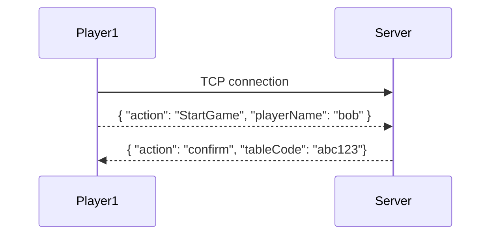
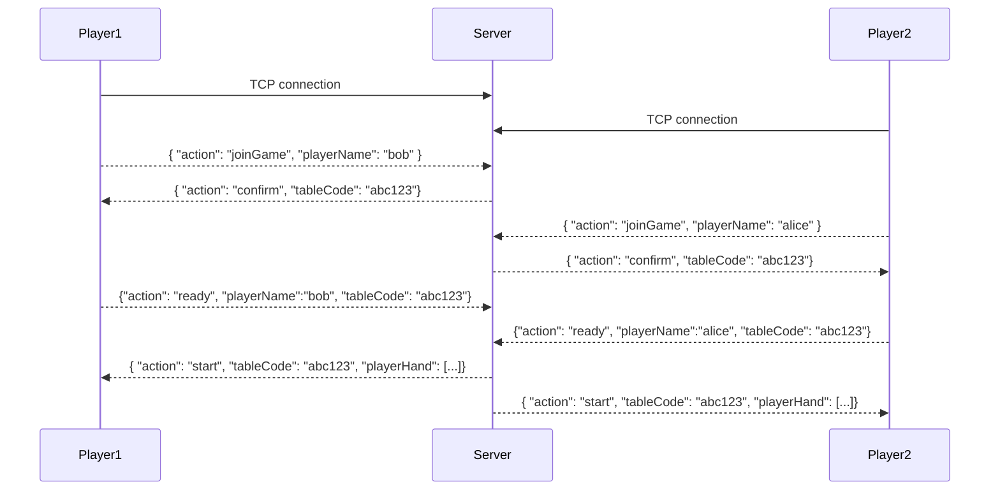

# Networking diagram for server to client communication

## Starting a New game

```mermaid
sequenceDiagram
    participant Player1
    participant Server

    Player1->>Server: TCP connection
    Player1-->>Server: { "action": "StartGame", "playerName": "bob" }
    Server-->>Player1: { "action": "confirm", "tableCode": "abc123"}
```

## Joining a Waiting game

```mermaid
sequenceDiagram
    participant Player1
    participant Server
    participant Player2

    Player1->>Server: TCP connection
    Player2->>Server: TCP connection
    Player1-->>Server: { "action": "joinGame", "playerName": "bob" }
    Server-->>Player1: { "action": "confirm", "tableCode": "abc123"}
    Player2-->>Server: { "action": "joinGame", "playerName": "alice" }
    Server-->>Player2: { "action": "confirm", "tableCode": "abc123"}
    Player1-->>Server: {"action": "ready", "playerName":"bob", "tableCode": "abc123"}
    Player2-->>Server: {"action": "ready", "playerName":"alice", "tableCode": "abc123"}
    Server-->>Player1: { "action": "start", "tableCode": "abc123", "playerHand": [...]}
    Server-->>Player2: { "action": "start", "tableCode": "abc123", "playerHand": [...]}
```

